# Nexora Database Relationship Map

This is the quick-reference companion to `DATABASE_DESIGN.md`.

It shows the main table relationships in a compact way so we can reason about the data model faster.

## 1. Core Tenancy And Identity

```text
Institute
  -> AcademicYear
  -> Program
  -> Cohort
  -> Subject
  -> Topic
  -> TeacherProfile
  -> StudentProfile
  -> Question
  -> Exam
  -> Attempt
  -> Result
  -> Notification
  -> AuditLog

User
  -> AccountProfile
      -> StudentProfile
      -> TeacherProfile
```

## 2. Main Relationship Chains

### Student flow

```text
Institute
  -> AcademicYear
  -> Program
  -> Cohort (optional)
  -> StudentProfile
  -> AccountProfile
  -> StudentExamAttempt
  -> StudentAnswer
  -> ExamResult
  -> StudentTopicPerformance
```

### Teacher flow

```text
Institute
  -> TeacherProfile
  -> TeacherAssignment
  -> AccountProfile
  -> Question
  -> Exam
```

### Assessment flow

```text
Exam
  -> ExamSection
  -> ExamQuestion
      -> Question
          -> QuestionOption
          -> QuestionAttachment
          -> QuestionTagMap
              -> QuestionTag

StudentExamAttempt
  -> StudentAnswer
  -> AttemptIntegrityEvent
  -> ExamResult
  -> StudentTopicPerformance
```

## 3. Mermaid ERD

```mermaid
erDiagram
    INSTITUTE ||--o{ ACADEMIC_YEAR : has
    INSTITUTE ||--o{ PROGRAM : has
    INSTITUTE ||--o{ COHORT : has
    INSTITUTE ||--o{ SUBJECT : has
    INSTITUTE ||--o{ TOPIC : has
    INSTITUTE ||--o{ TEACHER_PROFILE : has
    INSTITUTE ||--o{ STUDENT_PROFILE : has
    INSTITUTE ||--o{ QUESTION : has
    INSTITUTE ||--o{ EXAM : has
    INSTITUTE ||--o{ ACCOUNT_PROFILE : scopes
    INSTITUTE ||--o{ NOTIFICATION : has
    INSTITUTE ||--o{ AUDIT_LOG : has

    USER ||--|| ACCOUNT_PROFILE : owns
    STUDENT_PROFILE ||--|| ACCOUNT_PROFILE : linked_by_student
    TEACHER_PROFILE ||--|| ACCOUNT_PROFILE : linked_by_teacher

    ACADEMIC_YEAR ||--o{ COHORT : contains
    PROGRAM ||--o{ COHORT : groups
    PROGRAM ||--o{ SUBJECT : optionally_scopes
    SUBJECT ||--o{ TOPIC : contains
    TOPIC ||--o{ TOPIC : parent_child

    TEACHER_PROFILE ||--o{ TEACHER_ASSIGNMENT : gets
    ACADEMIC_YEAR ||--o{ TEACHER_ASSIGNMENT : scopes
    PROGRAM ||--o{ TEACHER_ASSIGNMENT : scopes
    COHORT ||--o{ TEACHER_ASSIGNMENT : optional_scope
    SUBJECT ||--o{ TEACHER_ASSIGNMENT : covers

    STUDENT_PROFILE ||--o{ STUDENT_EXAM_ATTEMPT : takes
    EXAM ||--o{ STUDENT_EXAM_ATTEMPT : receives
    STUDENT_EXAM_ATTEMPT ||--o{ STUDENT_ANSWER : contains
    STUDENT_EXAM_ATTEMPT ||--o{ ATTEMPT_INTEGRITY_EVENT : logs
    STUDENT_EXAM_ATTEMPT ||--|| EXAM_RESULT : produces

    EXAM ||--o{ EXAM_SECTION : contains
    EXAM ||--o{ EXAM_QUESTION : uses
    QUESTION ||--o{ EXAM_QUESTION : selected_as
    QUESTION ||--o{ QUESTION_OPTION : has
    QUESTION ||--o{ QUESTION_ATTACHMENT : has
    QUESTION ||--o{ QUESTION_TAG_MAP : tagged_by
    QUESTION_TAG ||--o{ QUESTION_TAG_MAP : maps

    EXAM ||--o{ EXAM_RESULT : results
    EXAM ||--o{ STUDENT_TOPIC_PERFORMANCE : aggregates
    STUDENT_PROFILE ||--o{ EXAM_RESULT : receives
    STUDENT_PROFILE ||--o{ STUDENT_TOPIC_PERFORMANCE : gets
    SUBJECT ||--o{ STUDENT_TOPIC_PERFORMANCE : analyzed_by
    TOPIC ||--o{ STUDENT_TOPIC_PERFORMANCE : analyzed_by
```



## 4. What The Relationships Mean

- `Institute` is the tenant root.
- `AccountProfile` is the login-to-domain bridge.
- `StudentProfile` and `TeacherProfile` are the business profiles.
- `AcademicYear`, `Program`, `Cohort`, `Subject`, and `Topic` form the operational academic hierarchy.
- `Exam` is the container for sections and questions.
- `StudentExamAttempt` is the live runtime record.
- `ExamResult` is the final published outcome.
- `InAppNotification` and `AuditLog` are supporting operational tables.

## 5. Practical Read Order

If you are trying to understand the system quickly, read the data in this order:

1. `Institute`
2. `AccountProfile`
3. `StudentProfile` / `TeacherProfile`
4. `AcademicYear`
5. `Program`
6. `Cohort`
7. `Subject`
8. `Topic`
9. `Question`
10. `Exam`
11. `StudentExamAttempt`
12. `StudentAnswer`
13. `ExamResult`
14. `StudentTopicPerformance`
15. `InAppNotification`
16. `AuditLog`

## 6. Important Design Notes

- The schema is institute-scoped almost everywhere.
- Public registration and internal registration both land in the same tenant/profile structure.
- JSON fields are used intentionally for registration context, accommodations, exam metadata, and reporting metadata.
- The schema is already suitable for assessment workflows and can be extended for subscriptions later without rewriting the core identity model.

