# Database Design And Model Relationship Reference

This document explains how the current backend data model is structured, how the major models are connected, and how data flows through the product.

It is based on the live Django models in `edutech_backend/apps/*/models.py`.

## 1. Design Principles

### Shared base behavior

Most business models inherit from `common.models.BaseModel`.

That gives each record:

- `id` as UUID primary key
- `created_at`
- `updated_at`
- `is_active`

This means most tables follow a soft-active pattern instead of only hard deletes.

### Tenant boundary

The main tenant boundary is `Institute`.

Most operational models are either:

- global master records
- institute-scoped records
- user-linked records that optionally point to an institute

### Two important data layers

The product has two major layers:

1. Master/shared layer
   - platform-level reusable content, onboarding profiles, catalog records, geography, option catalogs
2. Institute operational layer
   - institute academics, users, exams, attempts, results, economy, entitlements

## 2. High-Level Domain Map

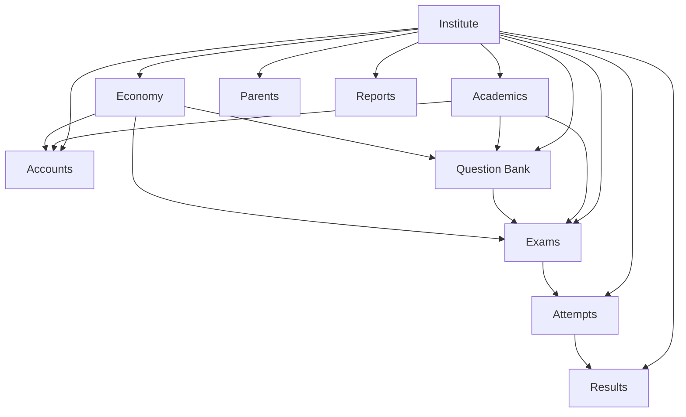

## 3. Core Tenant And Onboarding

### `Institute`

This is the primary tenant table.

It owns or scopes:

- academic years
- programs
- cohorts
- institute subjects and topics
- teacher profiles
- student profiles
- question bank rows
- exams
- attempts
- results
- economy records
- parent relationships
- notifications and audit logs

### `InstituteOnboardingProfile`

A configurable onboarding template for institutes.

Purpose:

- define reusable onboarding defaults
- avoid hardcoded setup logic
- support future “blank”, “trial”, “school”, “coaching”, or other onboarding profiles

### `InstituteOnboardingRun`

Tracks one onboarding execution for one institute.

Key links:

- `institute -> Institute`
- `profile -> InstituteOnboardingProfile`

### `InstituteOnboardingTaskRun`

Tracks individual onboarding task execution inside a run.

Key links:

- `run -> InstituteOnboardingRun`

### Relationship summary

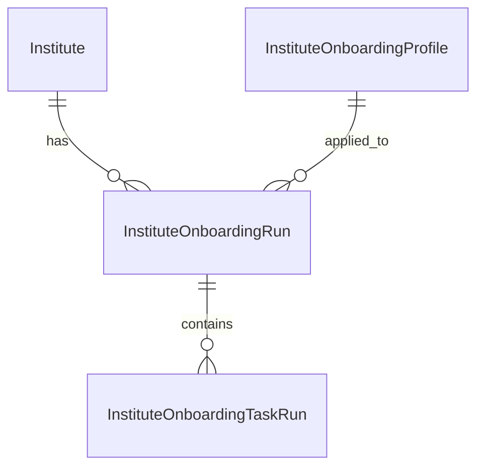

## 4. Accounts, Identity, And Role Mapping

### `AccountProfile`

This is the central application identity wrapper around Django `User`.

Key links:

- `user -> auth user` as one-to-one
- `institute -> Institute` optional
- `student_profile -> StudentProfile` optional one-to-one
- `teacher_profile -> TeacherProfile` optional one-to-one

Role values include:

- `platform_admin`
- `institute_admin`
- `teacher`
- `student`
- `parent`

This model is the main bridge between authentication and business roles.

### `AccountLocation`

Stores location metadata for an account profile.

Key link:

- `account_profile -> AccountProfile`

### `AccountAcquisition`

Stores lead/acquisition/source metadata for an account profile.

Key link:

- `account_profile -> AccountProfile`

### Practical meaning

The login user does not directly carry all academic context. The academic or role-specific entity is usually attached through `AccountProfile`.

## 5. Geography Master Data

These are global master tables, not institute-owned.

### `Country`

Top-level geography master.

### `State`

Key link:

- `country -> Country`

### `City`

Key link:

- `state -> State`

### `PostalCode`

Key link:

- `city -> City`

### Relationship summary

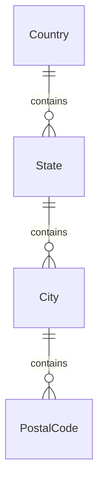

## 6. Academic Structure

This is the backbone for institute curriculum setup.

### `AcademicYear`

Key link:

- `institute -> Institute`

Purpose:

- define the operating school/coaching year
- anchor students, cohorts, and exams

### `AssessmentFamily`

Global classification for assessment families such as school, NEET, JEE, AWS, and others.

This helps a `Program` inherit the right assessment behavior.

### `Program`

Key links:

- `institute -> Institute`
- `assessment_family -> AssessmentFamily`

In the current product direction, this acts like the main academic preset/program lane.

Examples:

- Class 7
- Class 10 Foundation
- NEET Dropper Batch
- AWS Cloud Practitioner

### `Cohort`

Key links:

- `institute -> Institute`
- `program -> Program`
- `academic_year -> AcademicYear`

Purpose:

- sections, batches, divisions, or operational groups inside a program

### `Subject`

Key links:

- `institute -> Institute`
- `program -> Program` optional

Purpose:

- institute-usable subject rows for academic setup, question bank, exams, and reporting

### `Topic`

Key links:

- `institute -> Institute`
- `subject -> Subject`
- `parent_topic -> Topic` self-reference

Purpose:

- chapter / topic / subtopic hierarchy
- supports topic trees, not only flat chapters

### `OptionCatalogEntry`

A configurable option source table used to drive database-backed dropdowns and controlled selections.

This is important for reducing frontend hardcoding.

### Relationship summary

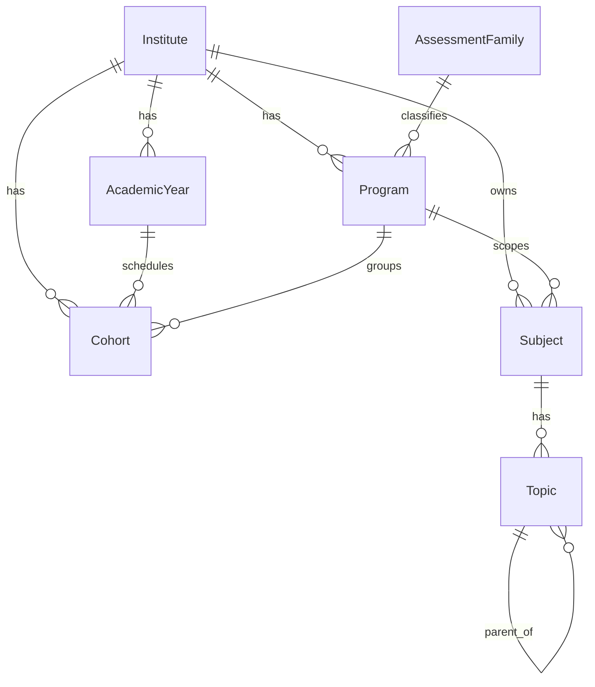

## 7. Student, Teacher, And Parent Role Models

### `StudentProfile`

Key links:

- `institute -> Institute`
- `academic_year -> AcademicYear`
- `program -> Program`
- `cohort -> Cohort` optional

This is the student’s academic identity.

### `TeacherProfile`

Key link:

- `institute -> Institute`

This is the teacher’s business identity.

### `TeacherAssignment`

Key links:

- `institute -> Institute`
- `teacher -> TeacherProfile`
- `academic_year -> AcademicYear`
- `program -> Program`
- `cohort -> Cohort` optional
- `subject -> Subject`

This is the teaching responsibility table.

### `ParentProfile`

Key links:

- `institute -> Institute`
- `account_profile -> AccountProfile`

### `ParentChildRelationship`

Key links:

- `institute -> Institute`
- `parent_profile -> ParentProfile`
- `student -> StudentProfile`

Controls:

- relationship type
- permissions like view progress, view results, wallet visibility, alerts
- workflow state such as pending, active, suspended, revoked

### `ParentAlert`

Key links:

- `institute -> Institute`
- `parent_profile -> ParentProfile`
- `student -> StudentProfile` optional
- `relationship -> ParentChildRelationship` optional

### Relationship summary

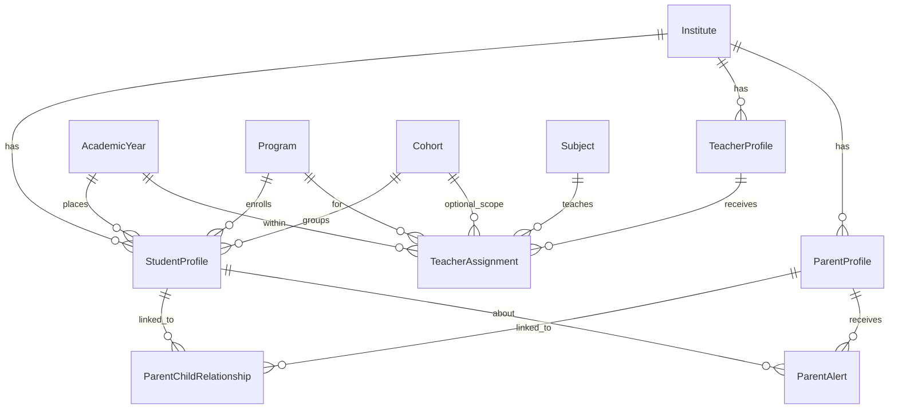

## 8. Question Bank Design

This is one of the most important areas in the system.

The model is intentionally split into two layers.

### A. Shared/master library

#### `MasterQuestion`

This is the platform/shared source question library.

Key links:

- `source_institute -> Institute` optional source ownership
- `source_program -> Program` optional
- `source_subject -> Subject`
- `source_topic -> Topic` optional
- `created_by_teacher -> TeacherProfile` optional

Meaning:

- can represent platform-authored or institute-originated source content
- serves as the reusable upstream content layer

#### `MasterQuestionOption`

Key link:

- `master_question -> MasterQuestion`

#### `MasterQuestionAttachment`

Key link:

- `master_question -> MasterQuestion`

### B. Institute-local question layer

#### `Question`

This is the institute-usable operational question row.

Key links:

- `institute -> Institute`
- `program -> Program` optional
- `subject -> Subject`
- `topic -> Topic` optional
- `created_by_teacher -> TeacherProfile` optional
- `master_question -> MasterQuestion` optional
- `passage -> QuestionPassage` optional

Meaning:

- locally created questions live here
- linked copies or materialized rows from the shared library also live here
- exam builder works against this layer

#### `QuestionOption`

Key link:

- `question -> Question`

#### `QuestionPassage`

Key links:

- `institute -> Institute`
- `program -> Program` optional
- `subject -> Subject`
- `topic -> Topic` optional
- `created_by_teacher -> TeacherProfile` optional

#### `QuestionAttachment`

Key link:

- `question -> Question`

#### `QuestionTag`

Key link:

- `institute -> Institute`

#### `QuestionTagMap`

Key links:

- `question -> Question`
- `tag -> QuestionTag`

### C. Shared-library access bridge

#### `InstituteQuestionAccess`

This is the approval/access bridge between master content and institute-local usage.

Key links:

- `institute -> Institute`
- `master_question -> MasterQuestion`
- `requested_by_teacher -> TeacherProfile` optional
- `approved_by -> auth user` optional
- `linked_question -> Question` optional
- local academic references like `program`, `subject`, `topic`

Meaning:

- tracks whether an institute or teacher can access a master question
- supports request/approve/link workflows
- records the local linked question row if one is materialized

### Relationship summary

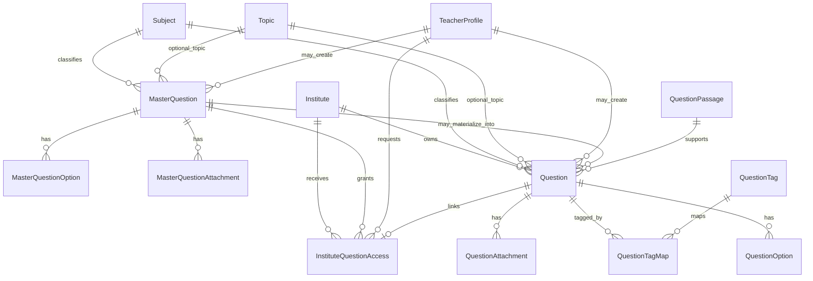

### Practical rule

- `MasterQuestion` is the source library record
- `Question` is the institute runtime record
- `InstituteQuestionAccess` is the permission/linking bridge

## 9. Exam Authoring And Delivery

### `Exam`

This is the root assessment entity.

Key links:

- `institute -> Institute`
- `academic_year -> AcademicYear`
- `program -> Program`
- `cohort -> Cohort` optional
- `subject -> Subject` optional
- `source_teacher -> TeacherProfile` optional

Important note:

- `subject` at exam level is optional because sections can carry subject-specific structure
- this supports the multi-subject exam direction

### `ExamSection`

Key links:

- `exam -> Exam`
- `subject -> Subject` optional

Purpose:

- section-level structure
- enables one exam to have multiple subject sections

### `ExamQuestion`

Key links:

- `exam -> Exam`
- `question -> Question`
- `section -> ExamSection` optional

Purpose:

- ordered mapping between exam and usable question rows

### `ExamStudentAssignment`

Key links:

- `exam -> Exam`
- `student -> StudentProfile`
- `assigned_by -> TeacherProfile` optional

### `ExamPublishLog`

Key links:

- `exam -> Exam`
- `changed_by -> TeacherProfile` optional

### `AdvancedExamTemplate`

Key links:

- `institute -> Institute`
- `created_by_teacher -> TeacherProfile` optional

Stores advanced builder blueprints.

### `ExamPresetPack`

Key links:

- `institute -> Institute` optional

Purpose:

- reusable exam configuration presets
- can be platform-scoped or institute-scoped

### Relationship summary

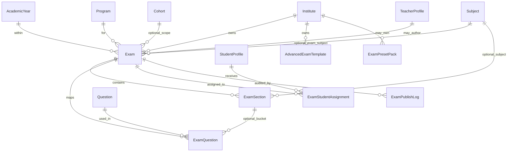

## 10. Attempt, Submission, And Review Flow

### `StudentExamAttempt`

Key links:

- `institute -> Institute`
- `exam -> Exam`
- `student -> StudentProfile`

This is the root runtime attempt.

### `StudentAnswer`

Key links:

- `attempt -> StudentExamAttempt`
- `question -> Question`
- `selected_option -> QuestionOption` optional
- `reviewed_by_teacher -> TeacherProfile` optional

This stores the actual response and evaluation state.

### `AttemptIntegrityEvent`

Key links:

- `institute -> Institute`
- `attempt -> StudentExamAttempt`
- `exam -> Exam`
- `student -> StudentProfile`

Tracks proctoring/integrity events.

### `StudentAnswerReviewTask`

Key links:

- `institute -> Institute`
- `answer -> StudentAnswer` one-to-one
- `attempt -> StudentExamAttempt`
- `exam -> Exam`
- `student -> StudentProfile`
- `question -> Question`
- `assigned_to_teacher -> TeacherProfile` optional
- `assigned_by_user -> auth user` optional
- `last_reviewed_by_teacher -> TeacherProfile` optional

This is the teacher review workflow object.

### `StudentAnswerReviewEvent`

Key links:

- `review_task -> StudentAnswerReviewTask`
- `answer -> StudentAnswer`
- `attempt -> StudentExamAttempt`
- `exam -> Exam`
- `student -> StudentProfile`
- `question -> Question`
- `actor_user -> auth user` optional
- `actor_teacher -> TeacherProfile` optional

This is the review audit/event stream.

### Relationship summary

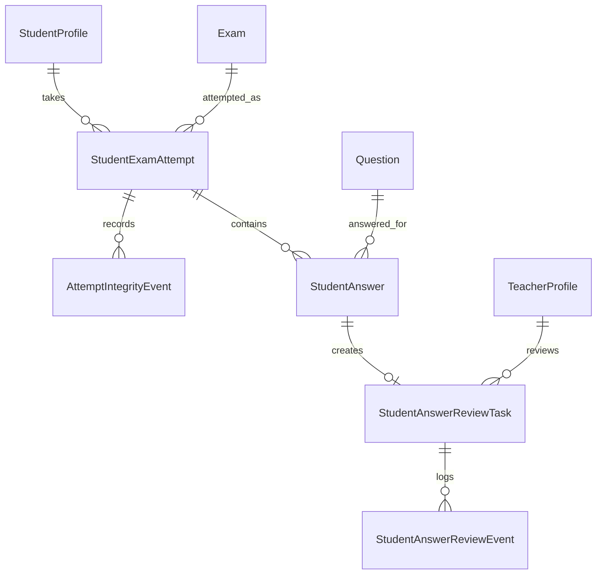

## 11. Results And Performance Analytics

### `ExamResult`

Key links:

- `institute -> Institute`
- `exam -> Exam`
- `student -> StudentProfile`
- `attempt -> StudentExamAttempt` one-to-one

This is the computed/published result record for a student attempt.

### `StudentTopicPerformance`

Key links:

- `institute -> Institute`
- `exam -> Exam`
- `student -> StudentProfile`
- `subject -> Subject`
- `topic -> Topic` optional

Stores detailed academic performance slices.

### `ExamPerformanceSummary`

Key links:

- `institute -> Institute`
- `exam -> Exam` one-to-one

Stores exam-level aggregate reporting.

### Relationship summary

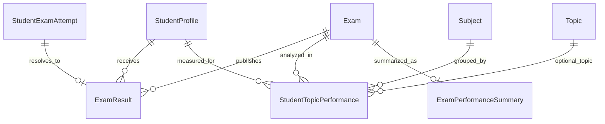

## 12. Economy, Subscription, Referral, Wallet, And Content Access

This domain is broad. It contains student value systems, package commerce, subscriptions, entitlements, usage, and content gating.

## 12.1 Student wallet and stars

### `StudentEconomyProfile`

Key links:

- `institute -> Institute`
- `student -> StudentProfile` one-to-one

This is the root wallet/economy profile for a student.

### `StarLedger`

Key links:

- `institute -> Institute`
- `student -> StudentProfile`
- `economy_profile -> StudentEconomyProfile`
- `created_by -> auth user` optional

This is the source of truth ledger for star credit/debit transactions.

### `RewardRule`

Key links:

- `institute -> Institute`
- `subject -> Subject` optional

Defines rules that can mint stars.

### `StudentRewardEvent`

Key links:

- `institute -> Institute`
- `student -> StudentProfile`
- `reward_rule -> RewardRule`
- `ledger_entry -> StarLedger` optional one-to-one

## 12.2 Referral

### `ReferralProgram`

Key link:

- `institute -> Institute`

### `ReferralCode`

Key links:

- `institute -> Institute`
- `program -> ReferralProgram`
- `owner_student -> StudentProfile`

### `ReferralEvent`

Key links:

- `institute -> Institute`
- `program -> ReferralProgram`
- `referral_code -> ReferralCode`
- `referrer_student -> StudentProfile`
- `referee_student -> StudentProfile`
- `referrer_ledger_entry -> StarLedger` optional one-to-one
- `referee_ledger_entry -> StarLedger` optional one-to-one

## 12.3 Packs, plans, and payments

### `StarPack`

Key link:

- `institute -> Institute`

### `SubscriptionPlan`

Key link:

- `institute -> Institute`

### `SubscriptionPlanCycle`

Key links:

- `institute -> Institute`
- `plan -> SubscriptionPlan`

### `SubscriptionStarCreditRule`

Key links:

- `institute -> Institute`
- `plan_cycle -> SubscriptionPlanCycle`

### `PaymentOrder`

Key links:

- `institute -> Institute`
- `student -> StudentProfile`
- `star_pack -> StarPack` optional
- `subscription_plan_cycle -> SubscriptionPlanCycle` optional

### `PaymentTransaction`

Key links:

- `institute -> Institute`
- `payment_order -> PaymentOrder`
- `ledger_entry -> StarLedger` optional one-to-one

### `StudentSubscription`

Key links:

- `institute -> Institute`
- `student -> StudentProfile`
- `plan_cycle -> SubscriptionPlanCycle`

### `SubscriptionBillingEvent`

Key links:

- `institute -> Institute`
- `student_subscription -> StudentSubscription`
- `payment_transaction -> PaymentTransaction` optional
- `ledger_entry -> StarLedger` optional one-to-one

## 12.4 Question-bank commerce

### `QuestionBankPackage`

Key link:

- `institute -> Institute`

Purpose:

- defines a commercial/shared library package
- package type, ownership type, access mode, catalog visibility, metadata

Important practical distinction:

- platform-owned packages can be used as shared/master defaults
- institute-owned packages are local commercial/configuration records

### `QuestionBankPackageScope`

Key links:

- `institute -> Institute`
- `package -> QuestionBankPackage`
- `program -> Program` optional
- `subject -> Subject` optional
- `topic -> Topic` optional

Purpose:

- define what the package covers academically
- define quotas and other package-level scope restrictions

### `SubscriptionPlanQuestionBankPackage`

Key links:

- `institute -> Institute`
- `subscription_plan -> SubscriptionPlan`
- `question_bank_package -> QuestionBankPackage`

Purpose:

- link commercial plans to packages

### `InstituteSubscriptionRequest`

Key links:

- `institute -> Institute`
- `subscription_plan_cycle -> SubscriptionPlanCycle`
- request/review user references

Purpose:

- institute-side request workflow for subscription activation

### `InstituteQuestionEntitlement`

Key links:

- `institute -> Institute`
- `question_bank_package -> QuestionBankPackage`
- `subscription_plan -> SubscriptionPlan` optional
- `subscription_plan_cycle -> SubscriptionPlanCycle` optional
- grant/revoke operator users

This is the main access-control row for package usage.

### `InstituteQuestionFeatureEntitlement`

Key links:

- `institute -> Institute`
- `source_package -> QuestionBankPackage` optional
- `source_subscription_plan -> SubscriptionPlan` optional

Purpose:

- feature flags backed by economy authority
- example: advanced exam builder entitlement

### `InstituteQuestionUsageLedger`

Key links:

- `institute -> Institute`
- `question_bank_package -> QuestionBankPackage`
- `entitlement -> InstituteQuestionEntitlement` optional
- `master_question -> MasterQuestion` optional
- `question -> Question` optional
- `exam -> Exam` optional
- `performed_by -> auth user` optional

Purpose:

- auditable consumption ledger for licensed/shared content usage

## 12.5 Content gating

These models use a shared content-targeting mixin.

### `ContentAccessPolicy`

Key link:

- `institute -> Institute`

Defines content access policy rules.

### `UnlockRule`

Key link:

- `institute -> Institute`

Defines unlock conditions.

### `StudentUnlockState`

Key links:

- `institute -> Institute`
- `student -> StudentProfile`
- `granted_by -> auth user` optional

Stores runtime unlock state.

### `StudentEntitlement`

Key links:

- `institute -> Institute`
- `student -> StudentProfile`
- `granted_by -> auth user` optional

Stores student-specific content entitlements.

### Economy relationship summary

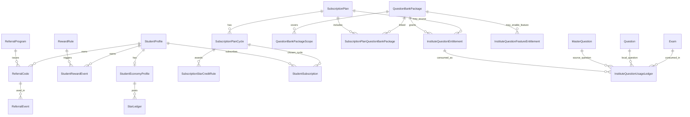

## 13. Notifications, Audit, And Operational Reporting

### `InAppNotification`

Key links:

- `institute -> Institute` optional
- `recipient_user -> auth user`

Purpose:

- app notification inbox
- exam/result/review operational messaging

### `AuditLog`

Key links:

- `institute -> Institute` optional
- `user -> auth user` optional

Purpose:

- actor, action, entity type, entity id, metadata, IP, user agent
- system audit trail

## 14. End-To-End Data Flow

## 14.1 Institute onboarding flow

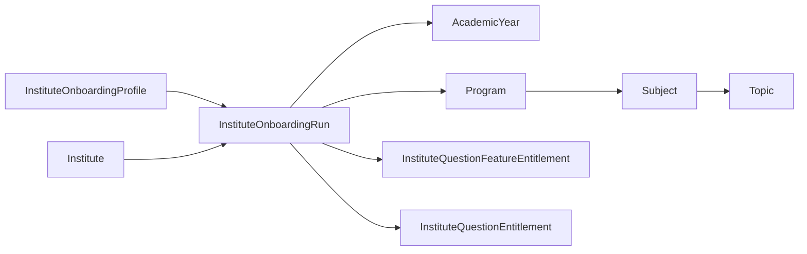

## 14.2 Question-to-exam flow

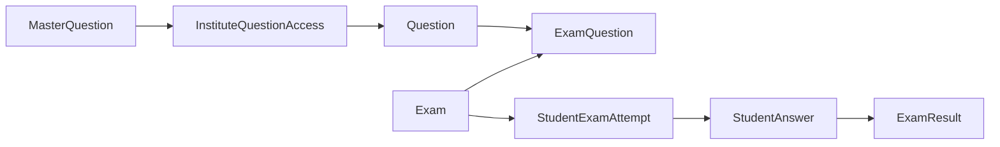

## 14.3 Economy-controlled package access flow

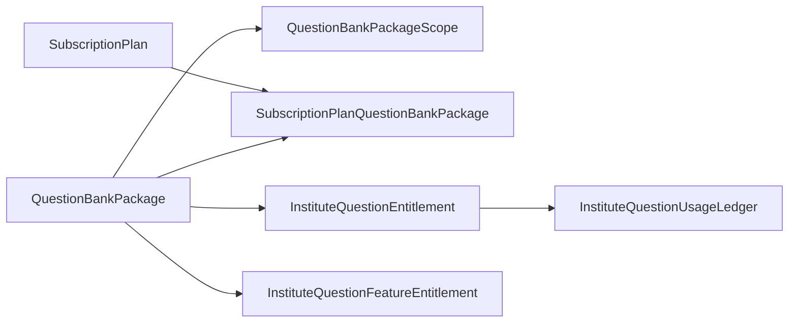

## 15. Important Authority Rules

### Academic authority

Academic structure is primarily driven by:

- `Institute`
- `AcademicYear`
- `Program`
- `Subject`
- `Topic`

### Exam authority

Exam availability and builder behavior are driven by:

- exam rows and assignments for normal operational access
- economy feature entitlements for gated lanes like advanced builder

### Economy authority

Economy is the source of truth for:

- question-bank package access
- feature entitlements
- subscription-to-package mapping
- usage ledger
- some monetized or gated workflow behavior

### Shared-library authority

Shared library availability requires all of:

- source content in `MasterQuestion`
- access path through package/entitlement if commercially controlled
- institute bridge through `InstituteQuestionAccess`
- local usable row in `Question` when materialized or linked

## 16. How Different Question-Bank Packages Are Distinguished

Packages are not differentiated by only one field.

They are distinguished by a combination of:

- `QuestionBankPackage.package_type`
- `QuestionBankPackage.ownership_type`
- `QuestionBankPackage.access_mode`
- `QuestionBankPackage.is_public_catalog`
- `QuestionBankPackageScope` rows
- linked `SubscriptionPlanQuestionBankPackage` rows
- active `InstituteQuestionEntitlement` rows
- optional feature rows in `InstituteQuestionFeatureEntitlement`

### Example distinctions

#### Package A: shared trial library

- platform-owned
- public catalog enabled
- subject-library type
- broad scopes
- granted through onboarding or trial entitlement

#### Package B: premium chapterwise library

- platform-owned
- narrower subject/topic scopes
- linked to paid subscription plan
- quota and feature limits enforced through entitlement and usage ledger

#### Package C: institute-private package

- institute-owned
- not public catalog
- only visible and usable within that institute’s scope

## 17. Recommended Mental Model

If you want to reason about the database quickly, use this chain:

1. `Institute` is the tenant root
2. `AccountProfile` connects login users to business roles
3. `AcademicYear -> Program -> Cohort -> Subject -> Topic` define academic structure
4. `MasterQuestion` is the shared source layer
5. `Question` is the institute runtime layer
6. `Exam -> ExamSection -> ExamQuestion` define delivery
7. `StudentExamAttempt -> StudentAnswer -> ExamResult` define execution and outcome
8. `QuestionBankPackage -> Entitlement -> UsageLedger` define commercial/shared access
9. `InstituteQuestionFeatureEntitlement` controls gated features like advanced builder

## 18. Current Design Strengths

- Clear tenant scoping through `Institute`
- Strong separation between shared source content and institute runtime content
- Economy authority is explicit instead of hidden in UI-only logic
- Advanced builder and package access can be driven from real entitlement tables
- Academic hierarchy already supports future configurable presets and default seeding

## 19. Current Design Complexity Areas

These are the areas that need the most care during implementation and QA:

- dual-layer question model: `MasterQuestion` vs `Question`
- package access vs feature access distinction
- onboarding defaults vs live economy authority
- exam-level subject vs section-level subject
- student entitlement/content unlock overlap with package-level access

## 20. Suggested Next Companion Documents

This database document is best paired with:

- API contract document by domain
- onboarding seeding workflow document
- question-bank package and entitlement lifecycle document
- exam creation lifecycle document
- economy permission matrix by role

