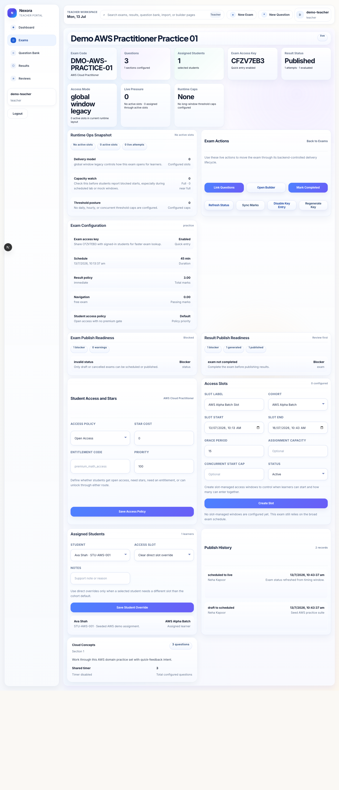

# Exam Detail And Lifecycle User Manual

## Overview

This guide explains how to open an exam, inspect its readiness, manage its lifecycle, and keep the delivery state truthful.

This manual is written for:

- teachers
- institute admins

The page is mostly the same for both roles, but institute admins usually see more institution-scoped operational context.

## Routes Covered

- `/teacher/exams/[examId]`
- `/institute/exams/[examId]`

## Before You Begin

Make sure the exam already exists and you have access to the correct role workspace.

This page is most useful when you need to:

- check publish readiness
- inspect sections and assignment counts
- review access policy or slot settings
- move the exam through live, completed, or canceled states
- recover a stale exam state by refreshing status

## Page Layout

The exam detail page is a live control panel, not just a summary card.

You will usually see:

- exam identity and subject summary
- exam code and lifecycle state
- question, section, and assignment counts
- exam access key controls
- publish readiness panels
- runtime access slots or policy controls
- publish history
- lifecycle actions

## Key Areas

### Exam Identity

Use this area to confirm:

- title
- subject
- code
- description
- current lifecycle state

This is the quickest way to make sure you opened the correct exam before doing any action.

### Exam Readiness

The readiness panels show whether the exam is ready for delivery and whether result publishing can happen safely.

Look for:

- section completeness
- question linking
- assignment coverage
- result readiness
- publish timeline or history

### Access And Runtime Controls

This page may include controls for:

- access key on or off
- access key regeneration
- live slot creation
- slot updates
- student slot overrides
- commercial access policy updates

These controls are what keep the exam delivery predictable under load.

### Lifecycle Actions

Common exam lifecycle actions include:

- refresh status
- sync marks
- publish
- mark live
- mark completed
- cancel

Tip:
Use `refresh status` first when the page looks stale. It is the safest recovery action.

## Common Tasks

### Refresh Exam Status

1. Open the exam detail page.
2. Find the lifecycle actions section.
3. Click `Refresh Status`.
4. Wait for the updated readiness panels to reload.

Use this when the page has outdated state after a backend update or another operator action.

### Publish An Exam

1. Confirm the exam is complete.
2. Check the publish readiness panel.
3. Verify the question and assignment counts are correct.
4. Click `Publish` when the readiness state allows it.

Warning:
Do not publish if the exam still has missing sections, missing questions, or incorrect access policy values.

### Update Exam Access Policy

1. Open the exam access section.
2. Select the desired commercial path.
3. Enter star cost or entitlement code if required.
4. Save the policy changes.

This is where star unlock, subscription, institute-sponsored, and platform-managed behavior is kept explicit.

### Manage Access Slots

1. Open the runtime or access slot section.
2. Create a slot if the exam needs a bounded window.
3. Review occupancy after assignments start.
4. Update the slot if the learner load changes.

This keeps the exam scalable and avoids everyone entering through one oversized open window.

### Review Publish History

1. Open the publish history panel.
2. Review the last action timestamps.
3. Confirm the state matches the expected delivery stage.

Use this to answer: who changed the exam, when, and what state it moved into.

## Common Mistakes

- Publishing before section setup is complete
- Confusing assignment count with active attempt count
- Changing the access policy without checking student entitlement behavior
- Treating a stale page as the source of truth instead of refreshing first

## Troubleshooting

### The page shows incomplete data

Try:

1. Refresh the exam status.
2. Re-open the detail page.
3. Confirm the backend session is still valid.

### An action fails

Check whether:

- the exam is in the wrong lifecycle state
- required counts are missing
- the access policy is invalid
- the backend rejected the request due to permissions or scheduling rules

## Related Pages

- Exam Creation And Builder
- Question Bank And Import
- Results And Analytics
- Student Exam Taking Flow

