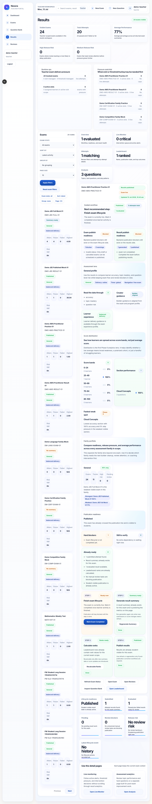
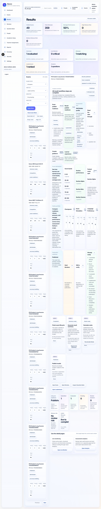
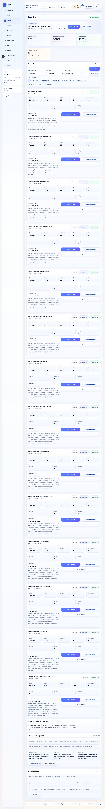
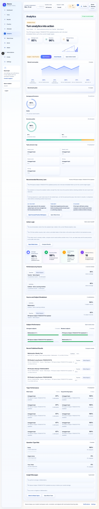

# Results And Analytics User Manual

## Overview

This guide explains how to inspect results, publication state, summary views, and learning analytics.

This manual is written for:

- teachers
- institute admins
- students

The result experience is role-aware, but the core truth is the same:

- some results are pending
- some are summary-only
- some support full review
- some need follow-up action

## Routes Covered

- `/teacher/results`
- `/institute/results`
- `/app/results`
- `/app/analytics`

## Before You Begin

Make sure the exam or attempt has already progressed far enough to generate a result record.

If results are missing, check:

- whether publication has happened
- whether the attempt is complete
- whether the current filters are hiding the record

## Page Layout

Results pages usually combine:

- filter bars
- grouping controls
- result cards or tables
- visibility and publication indicators
- summary or review links
- analytics drill-down panels

## Key Areas

### Filters

Use filters to narrow by:

- publication state
- result status
- score band
- rank
- source
- review availability

### Grouping

Grouping helps you compare results by:

- source
- outcome
- review state

### Summary And Review

The result card or row may provide:

- summary access
- answer review access
- practice follow-up action
- publication readiness messaging

### Analytics

Analytics views help students and support staff understand:

- weak topics
- trend lines
- source comparisons
- timeline progress

## Common Tasks

### Filter Results

1. Open the results page.
2. Choose the publication or outcome filter.
3. Apply the filter.
4. Check whether the result cards match the expected scope.

### Open Summary

1. Open the result card.
2. Click the summary link.
3. Review the post-submit state and the score summary.

### Open Review

1. Open a published result that supports review.
2. Click `Open Answer Review`.
3. Check whether the review route is available or intentionally blocked.

### Inspect Analytics

1. Open analytics from the student workspace.
2. Drill into a source, subject, or timeline view.
3. Confirm the context stays stable while navigating between drill-downs.

Tip:
When results and analytics disagree, trust the publication state and current filters first.

## Common Mistakes

- expecting a review link before the result is published
- assuming every attempt has the same visibility rules
- mixing teacher/institute summaries with student-safe analytics
- forgetting that filters can hide the exact result you are looking for

## Troubleshooting

### A result does not appear

Check whether:

- the result is still pending publication
- the wrong source or status filter is active
- the student has not completed the attempt

### Review is unavailable

That usually means:

- review has not been enabled yet
- the result is summary-only
- the current route intentionally blocks review

## Related Pages

- Exam Detail And Lifecycle
- Student Exam Taking Flow
- Question Bank And Import

