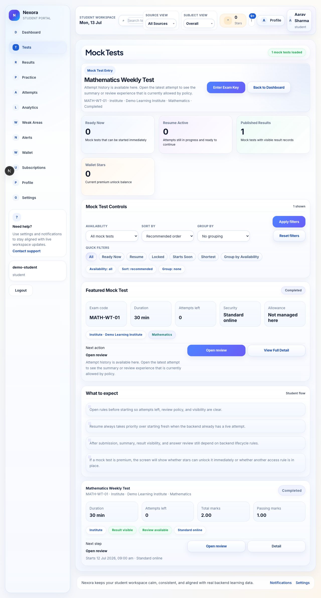
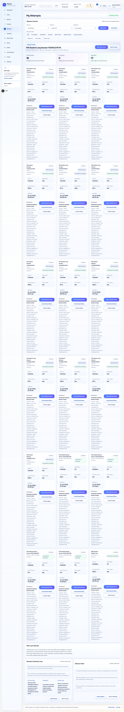

# Student Exam Taking Flow User Manual

## Overview

This guide explains how a student discovers an exam, opens the exam detail page, starts or resumes an attempt, saves progress, switches sections, and submits the attempt safely.

This manual is written for:

- students

## Routes Covered

- `/app/exams`
- `/app/exams/[examId]`
- `/app/attempts`
- `/app/attempts/[attemptId]`
- `/app/attempts/[attemptId]/summary`
- `/app/attempts/[attemptId]/review`

## Before You Begin

Make sure you have:

- a student account
- access to the exam window or exam key if the exam requires one
- a stable browser session
- enough time to finish the attempt before the timer ends

Tip:
If the exam uses secure mode, expect fullscreen, focus, or timer guidance on the attempt page.

## Page Layout

The student journey usually moves through four screens:

1. exams list
2. exam detail
3. attempt workspace
4. summary and review

## Key Areas

### Exams List

Use this page to:

- discover available exams
- inspect open or assigned tests
- open exam detail

### Exam Detail

The exam detail page shows:

- availability
- instructions
- access policy
- timer and security rules
- start or resume actions

### Attempt Workspace

The attempt workspace is where students:

- answer questions
- save progress
- move across sections
- review timer pressure
- submit the attempt

### Summary And Review

After submit, the student can usually:

- inspect the attempt summary
- review answers if the exam allows it
- move back into practice or analytics

## Common Tasks

### Start An Attempt

1. Open the exams list.
2. Open the exam detail page.
3. Review the timer and access rules.
4. Click `Start` or `Resume` when the action is available.

### Save Work

1. Answer a question.
2. Click `Save Answer`.
3. Confirm the page shows that the answer was stored.

### Switch Sections

1. Open the section switcher or section navigation.
2. Move to the next section.
3. Confirm the question and timer context still look correct.

### Submit The Attempt

1. Review the visible questions.
2. Confirm the answers you want to keep.
3. Click `Submit Test`.
4. Read the confirmation carefully before final submit.

### Open Summary Or Review

1. Open the attempts list.
2. Find the completed attempt.
3. Open summary first.
4. Open review only if the result state allows it.

## Common Mistakes

- starting the exam without checking the timer
- assuming the attempt auto-saves every navigation step
- leaving the page while expecting unsaved work to persist
- trying to open review before publication or review availability exists

## Troubleshooting

### No start button appears

Check whether:

- the exam window is closed
- the attempt is already in progress
- the exam needs an access key or additional entitlement

### Save fails

Check whether:

- the network is offline
- the browser session expired
- the question type requires special input or attachments

### The page looks locked

That can mean:

- the exam has ended
- the attempt is already submitted
- the attempt is in a secured state that does not allow editing

## Related Pages

- Results And Analytics
- Exam Detail And Lifecycle

