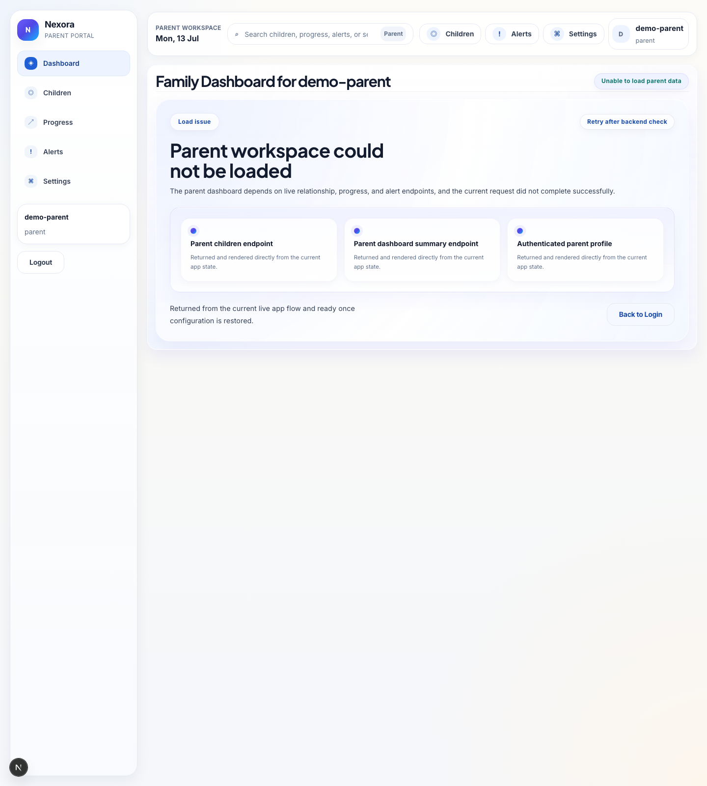
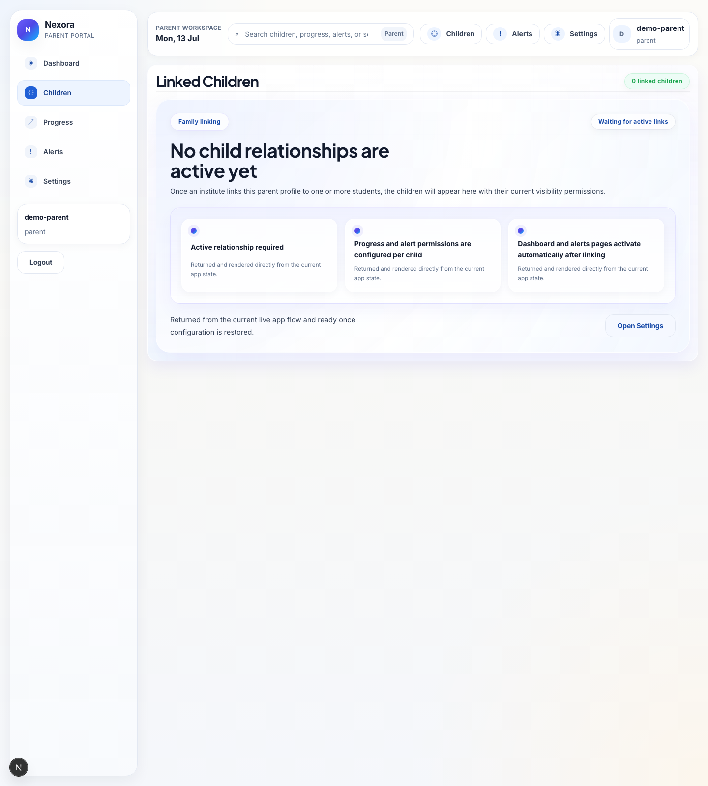
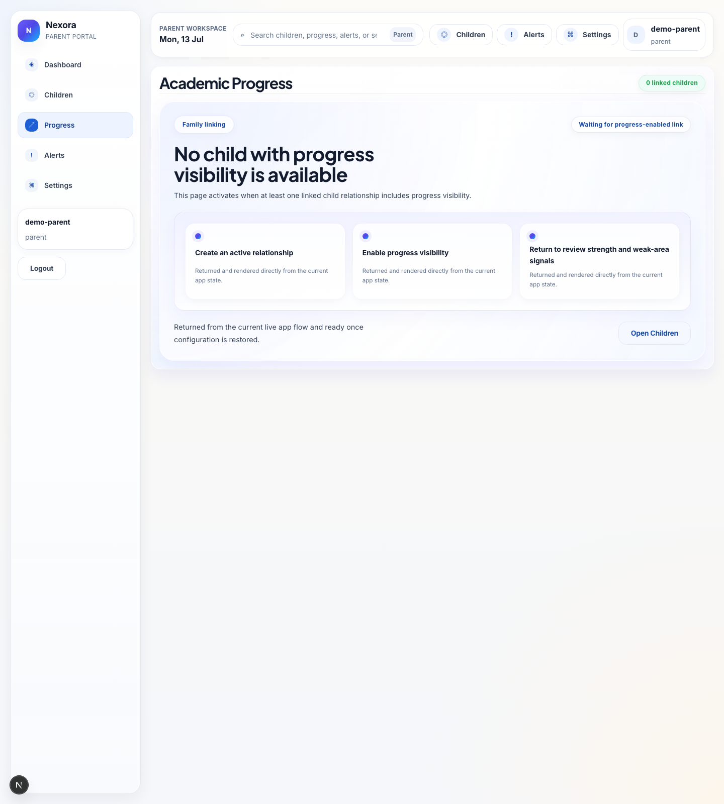
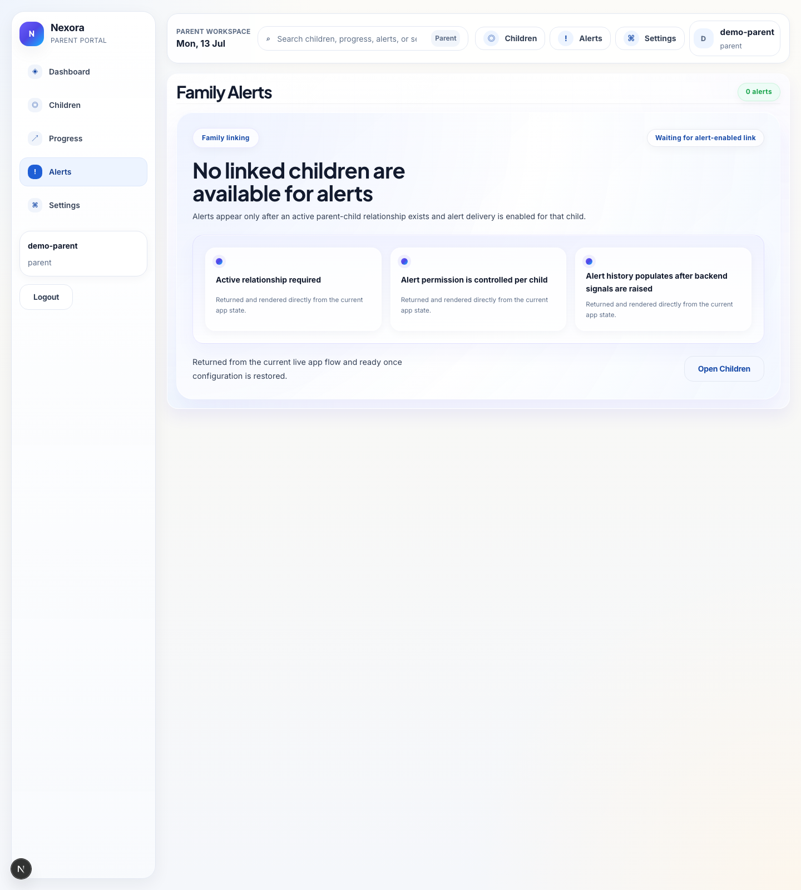
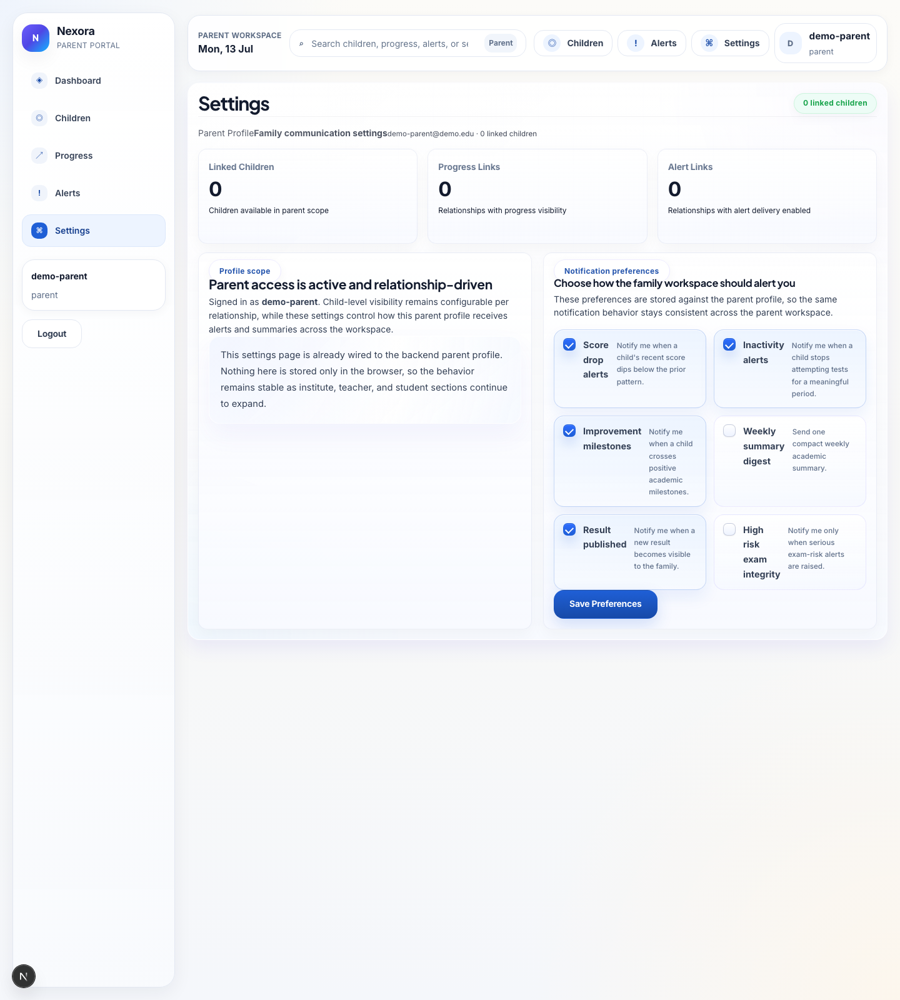
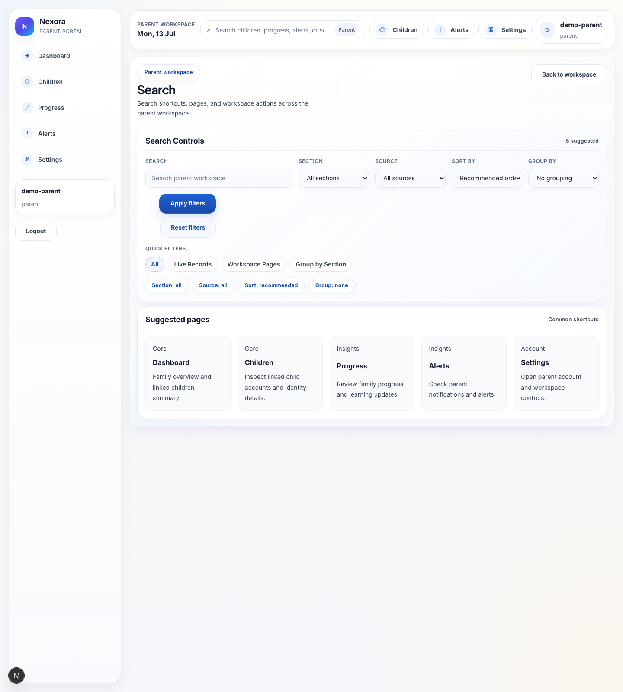

# Parent User Guide

Parent is the family-support role. This role is used to follow linked children, review progress, read alerts, and manage parent preferences.

## Main menu

- Dashboard
- Children
- Progress
- Alerts
- Settings
- Search is available from the top bar

## What this role does

Use parent when you need to:

- see linked children
- review child progress and readiness
- inspect alerts and family guidance
- adjust notification or workspace preferences
- move from a child summary into a more detailed family view

## Key screens

### Dashboard

This is the family starting point for summary cards, child scope, and next actions.

### Children

Use this screen to review linked children and move into child-specific views.

### Progress

Use this screen to understand progress trends and readiness signals.

### Alerts

Use this screen to inspect alerts, severity, and status updates.

### Settings

Use this screen to manage preferences and workspace controls.

### Search

Use search to quickly jump between children, alerts, progress, and settings.

## Common workflows

### Review a child

1. Open `Children`.
2. Pick the linked child you want to inspect.
3. Open `Progress` for trends.
4. Open `Alerts` if you need current issues or reminders.

### Stay on top of changes

1. Open `Dashboard`.
2. Review the main summary cards.
3. Check `Alerts` for urgent updates.
4. Use `Settings` if you want to tune notifications.

## Helpful notes

- Parent is intentionally observational and supportive.
- Parent does not take exams or manage institute content.

