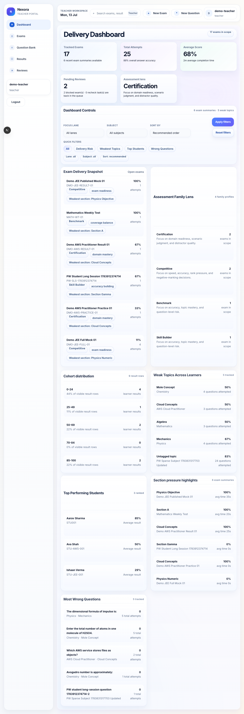
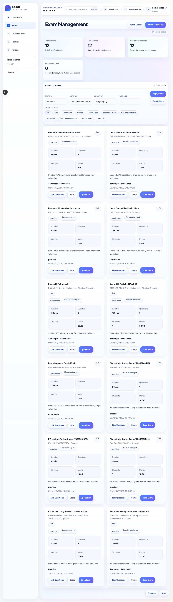
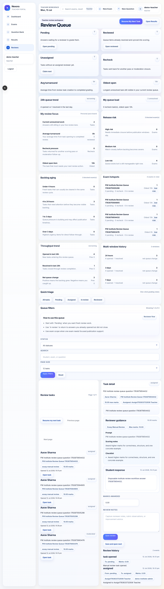
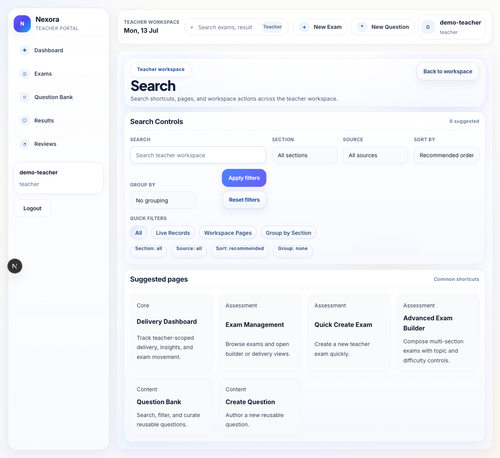

# Teacher User Guide

Teacher is the authoring and delivery role. This role is used to create questions, build exams, review results, and handle manual review workflows.

## Main menu

- Dashboard
- Exams
- Question Bank
- Results
- Reviews
- Search is available from the top bar

## What this role does

Use teacher when you need to:

- build or refine exam content
- manage question bank content
- review result trends
- manage live or manual review work
- hand off from authoring to delivery

## Key screens

### Dashboard

This is the starting point for workload, quick actions, and important handoffs.

### Exams

Use this screen to open exam detail and move into builder or release steps.

### Question Bank

Use this screen to browse, filter, and create questions.

### Results

Use this screen to review performance, analysis, and outcome summaries.

### Reviews

Use this screen to work through review queues and grading follow-ups.

### Search

Use search to jump to exams, question bank content, results, and review work.

## Common workflows

### Create a question

1. Open `Question Bank`.
2. Create a new question.
3. Fill in the content, explanation, and metadata.
4. Save and verify the row appears in the list.

### Prepare an exam

1. Open `Exams`.
2. Open the exam detail page.
3. Review readiness, policy, and builder actions.
4. Hand off into the builder when you need sections or linked questions.

### Review outcomes

1. Open `Results`.
2. Inspect the summary and trend cards.
3. Open `Reviews` if manual grading is required.
4. Use `Search` when you need to move directly to a specific item.

## Helpful notes

- Teacher uses a smaller menu than institute or admin.
- The exam builder lives inside the exam workflow, so the list page is the normal starting point.

