# Database Structure And Schema Relationships

Last updated: 2026-07-18

## Purpose

This document explains the current backend data model for `edutech_backend` at a system level:

- what each schema/app is responsible for
- which tables are central to the platform
- how the major entities relate to each other
- which relational paths drive the main product flows

It is based on the Django model definitions under `edutech_backend/apps/*/models.py`.

## Global conventions

Most business tables inherit from [`BaseModel`](/Users/ansh/Documents/Eductech/edutech_backend/common/models.py), which gives them:

- `id` as a UUID primary key
- `created_at`
- `updated_at`
- `is_active`

This means the system uses:

- UUID-first entity identity
- soft-active lifecycle on most tables
- timestamped auditability by default

Two broad structural rules appear throughout the backend:

1. `Institute` is the main tenant boundary.
2. `AcademicYear -> Program -> Cohort -> Subject -> Topic` is the main academic scope chain.

## Schema map

The backend is organized by Django app, and each app behaves like a domain schema:

- `institutes`: tenant and onboarding setup
- `accounts`: authentication-linked role identity
- `academics`: academic scope and option catalogs
- `students`: student master records
- `teachers`: teacher master records and teaching assignments
- `question_bank`: authoring and shared-question content
- `exams`: exam configuration, structure, assignment, and access
- `attempts`: runtime student attempts, answers, integrity, and review tasks
- `results`: published scoring and analytics summaries
- `economy`: stars, subscriptions, entitlements, unlocks, and payments
- `parents`: parent identity, parent-student links, alerts
- `reports`: notifications and audit logs
- `geography`: country/state/city/postal lookup hierarchy

## Design To Implementation Gap Review

This section highlights where the current implementation is weaker than the intended relational design.

### Gap 1: Business invariants rely on Django validation instead of database constraints

Observed in:

- [`StudentProfile.clean()`](/Users/ansh/Documents/Eductech/edutech_backend/apps/students/models.py:75)
- [`Exam.clean()`](/Users/ansh/Documents/Eductech/edutech_backend/apps/exams/models.py:250)
- [`StudentExamAttempt.clean()`](/Users/ansh/Documents/Eductech/edutech_backend/apps/attempts/models.py:90)

Examples of rules currently enforced in Python:

- student academic year must belong to the same institute
- student cohort must match the selected program and academic year
- exam end time must be after start time
- passing marks cannot exceed total marks
- attempt slot must belong to the same exam
- attempt submission time cannot be earlier than start time

Why this is a gap:

- these rules are part of the data design, not just UI behavior
- they can be bypassed by bulk imports, raw SQL, unmanaged scripts, or code paths that skip `full_clean()`
- the database can still accept structurally invalid rows even when the model layer would reject them

Implementation impact:

- higher risk of cross-tenant inconsistencies
- harder cleanup when bad rows enter analytics, exams, or results flows
- reduced trust in downstream reports and entitlement logic

Recommended fix direction:

- add `CheckConstraint`s for timeline and numeric invariants
- add stronger composite constraints where relational consistency can be enforced
- keep model `clean()` for friendly validation messages, but stop depending on it as the only guard

### Gap 2: Onboarding actor reference is not a foreign key

Observed in:

- [`InstituteOnboardingRun`](/Users/ansh/Documents/Eductech/edutech_backend/apps/institutes/models.py:84)
- field: [`initiated_by_user_id`](/Users/ansh/Documents/Eductech/edutech_backend/apps/institutes/models.py:106)

Why this is a gap:

- the onboarding workflow is relational and audit-sensitive
- the initiating user is stored as a plain integer instead of a foreign key
- the database cannot guarantee that the referenced user exists
- joins, deletions, and actor tracing are weaker than in the rest of the schema

Implementation impact:

- orphaned actor references are possible
- audit history is less reliable
- admin tooling and future reporting need extra defensive handling

Recommended fix direction:

- replace `initiated_by_user_id` with a nullable FK to `settings.AUTH_USER_MODEL` or the canonical account actor model
- backfill existing values with a data migration

### Gap 3: Audit/log model conventions are inconsistent

Observed in:

- shared base model: [`BaseModel`](/Users/ansh/Documents/Eductech/edutech_backend/common/models.py:6)
- divergent table: [`ExamPublishLog`](/Users/ansh/Documents/Eductech/edutech_backend/apps/exams/models.py:591)

Why this is a gap:

- most business entities use UUID primary keys plus `created_at`, `updated_at`, and `is_active`
- `ExamPublishLog` uses a plain `models.Model`
- this creates a mixed audit model strategy inside the same exam domain

Implementation impact:

- inconsistent primary key strategy
- inconsistent lifecycle handling
- extra branching if logs ever need the same retention or archival behavior as other entities

Recommended fix direction:

- decide whether audit logs are intentionally append-only and exempt from shared conventions
- if not intentional, migrate log-style tables to a standardized audit base

Phase 3 decision:

- `ExamPublishLog` should remain an append-only event log rather than be force-fit onto `BaseModel`
- mutable operational entities should continue to use `BaseModel`
- append-only event logs should expose read-only APIs and admin surfaces
- this avoids a high-risk primary-key migration while still giving a consistent audit policy

Audit model policy:

- use `BaseModel` for records that can be updated, soft-disabled, re-saved, or administratively corrected
- use lightweight append-only log tables for immutable event history
- append-only log tables must be read-only in API and admin usage
- append-only log tables should always have a creation timestamp and stable relational links to the affected entity and actor

### Gap 4: Important business state is stored in flexible JSON instead of typed structures

Observed in:

- [`InstituteOnboardingRun.requested_config_json`](/Users/ansh/Documents/Eductech/edutech_backend/apps/institutes/models.py:104)
- [`InstituteOnboardingRun.resolved_config_json`](/Users/ansh/Documents/Eductech/edutech_backend/apps/institutes/models.py:105)
- [`Exam.metadata`](/Users/ansh/Documents/Eductech/edutech_backend/apps/exams/models.py:223)
- [`StudentExamAttempt.metadata`](/Users/ansh/Documents/Eductech/edutech_backend/apps/attempts/models.py:67)

Why this is a gap:

- metadata fields are fine for loose annotations
- some of these JSON fields carry product behavior, runtime configuration, or student support state
- the schema does not strongly define their shape, versioning, or query semantics

Implementation impact:

- weak discoverability for analytics and admin reporting
- higher migration complexity when JSON structure changes
- less confidence in cross-service contracts

Recommended fix direction:

- separate true metadata from business-critical structured data
- keep low-risk freeform metadata in JSON
- promote stable, queryable business structures into typed columns or child tables
- for remaining JSON, define explicit schema contracts and migration/version rules

## Phase-Wise Remediation Plan

### Phase 1: Protect the highest-risk integrity rules

Target apps:

- `students`
- `exams`
- `attempts`

Actions:

- add DB constraints for date ordering and non-negative numeric rules
- add constraints for score and marks relationships
- identify cross-table rules that cannot be expressed directly and document them as application-enforced invariants
- add migration tests that prove invalid rows are rejected at the database level

Deliverable:

- database-backed guardrails for the core exam and attempt lifecycle

### Phase 2: Normalize audit-critical references

Target apps:

- `institutes`
- `accounts`

Actions:

- replace raw actor IDs with foreign keys
- review similar fields elsewhere to ensure no more hidden pseudo-relations exist
- add data migrations and null-safe backfill rules

Deliverable:

- stronger actor lineage for onboarding and operational audit trails

### Phase 3: Standardize audit model strategy

Target apps:

- `exams`
- `reports`

Actions:

- define when a table should inherit `BaseModel`
- define when append-only logs should intentionally remain immutable lightweight tables
- align outlier models with that policy

Deliverable:

- one documented audit-table standard across the backend

### Phase 4: Reduce overuse of JSON for business state

Target apps:

- `students`
- `institutes`
- `exams`
- `attempts`
- `economy`

Actions:

- classify every JSON field as one of:
- metadata
- configuration
- business state
- event payload
- convert high-value business state JSON into typed structures first
- keep flexible metadata JSON only where relational modeling adds little value

Deliverable:

- clearer long-term schema boundaries and easier reporting/analytics

Phase 4 assessment:

- most JSON usage falls into four buckets:
- `metadata`
- `configuration`
- `event payload`
- `business state`
- only the last category should be a priority for normalization into typed schema

Phase 4 completion status:

- `StudentProfile.accommodation_profile` was normalized into `StudentAccommodationProfile` and the legacy JSON column was retired
- `InstituteSubscriptionRequest.grant_modes` was normalized into `InstituteSubscriptionRequestGrantMode` and the legacy JSON column was retired
- `StudentAnswer.selected_option_ids` was normalized into `StudentAnswerSelectedOption` and the legacy JSON column was retired
- API compatibility was preserved through computed serializer fields and explicit setter methods during the transition

## JSON Field Classification

### Safe to keep as metadata

These are low-risk extensibility fields where relational modeling adds little value today:

- `Institute.metadata`
- `Exam.metadata`
- `MasterQuestion.metadata`
- `Question.metadata`
- `QuestionPassage.metadata`
- `InstituteQuestionAccess.metadata`
- `StarLedger.metadata`
- `RewardRule.metadata`
- `StudentRewardEvent.metadata`
- most `economy.*.metadata` audit and annotation fields

Guidance:

- keep these as JSON
- document expected keys when they become relied on by UI or reporting
- avoid storing primary workflow decisions here

### Valid configuration JSON that can remain JSON for now

These fields are structured config rather than transactional state:

- `AssessmentFamily.allowed_question_types`
- `AssessmentFamily.scoring_defaults`
- `AssessmentFamily.delivery_defaults`
- `AssessmentFamily.analytics_preset`
- `AssessmentFamily.authoring_hints`
- `InstituteOnboardingProfile.config_json`
- `AdvancedExamTemplate.blueprint`
- `ExamPresetPack.config`

Why these can stay JSON for now:

- they behave like templates or policy blobs
- they are versionable and usually read as a whole object
- breaking them into many small tables would add complexity before there is strong query demand

Recommended guardrail:

- add schema-version keys and documented shape expectations for each config object

### Event payload JSON that is acceptable but should be bounded

These fields are attached to runtime or workflow events:

- `InstituteOnboardingRun.requested_config_json`
- `InstituteOnboardingRun.resolved_config_json`
- `InstituteOnboardingTaskRun.result_json`
- `StudentExamAttempt.metadata`
- `AttemptIntegrityEvent.metadata`
- `StudentAnswer.response_artifacts`
- `StudentAnswerReviewTask.metadata`
- `StudentAnswerReviewEvent.metadata`

Why they are acceptable:

- they capture contextual snapshots or artifacts
- they are often easiest to preserve as semi-structured payloads

Recommended guardrail:

- define max expected shape and usage boundaries
- keep search/reporting needs out of these fields unless explicitly indexed elsewhere

### Business state JSON that should be normalized first

These were the main design-to-implementation risks and are now completed:

- `StudentAccommodationProfile`
- `StudentAnswerSelectedOption`
- `InstituteSubscriptionRequestGrantMode`

Why these are higher risk:

- they directly influence product behavior, eligibility, or evaluation semantics
- they are likely to become reporting and workflow inputs
- they hide real business concepts that deserve stronger contracts

Normalization outcome:

1. `StudentProfile.accommodation_profile` -> `StudentAccommodationProfile`
2. `InstituteSubscriptionRequest.grant_modes` -> `InstituteSubscriptionRequestGrantMode`
3. `StudentAnswer.selected_option_ids` -> `StudentAnswerSelectedOption`

## Suggested Normalization Targets

### 1. Student accommodations

Completed model:

- `StudentAccommodationProfile`

Problem:

- this is not just metadata
- accommodations often affect timing, assistive allowances, and attempt behavior
- storing them as an untyped object weakens auditability and cross-feature consistency

Implemented direction:

- `StudentAccommodationProfile`
- typed columns for extra time minutes, extra time percentage, violation allowance, simplified warning copy, instructions, notes, and source

Expected gain:

- stronger linkage between student support policy and exam runtime behavior
- cleaner compliance and reporting

### 2. Institute subscription request grant modes

Completed model:

- `InstituteSubscriptionRequestGrantMode`

Problem:

- this is a controlled business list, not freeform metadata
- it drives entitlement behavior and approval flow

Implemented direction:

- typed child records linked to `InstituteSubscriptionRequest`
- ordered grant-mode rows with uniqueness constraints

Expected gain:

- cleaner approval logic
- better filtering and policy analytics

### 3. Multi-select answer storage

Completed model:

- `StudentAnswerSelectedOption`

Problem:

- this encodes a relational answer choice set in JSON
- it is harder to validate, query, and analyze than a child-answer-option table

Implemented direction:

- `StudentAnswerSelectedOption`
- fields: `student_answer`, `question_option`, `selected_order`

Expected gain:

- stronger referential integrity
- simpler correctness and distractor analysis
- better support for multi-select and matrix-style analytics

## Phase 4 conclusion

The backend does not have a blanket JSON problem. Most JSON fields are acceptable as metadata, config, or event payloads. The real implementation gap is narrower:

- student accommodations
- controlled entitlement mode lists
- relational answer selections stored as JSON arrays

These were the highest-value normalization candidates and have now been completed.

### Phase 5: Add schema governance to future development

Actions:

- require every new model to declare whether invariants are DB-enforced, app-enforced, or both
- add review checklist items for tenant isolation, FK integrity, and JSON justification
- add migration-level tests for critical constraints

Deliverable:

- reduced drift between database design and implementation over time

## Schema Governance Checklist

Use this checklist whenever a new model, field, relation, or migration is introduced.

### 1. Tenant isolation

- Does the record belong to an `Institute` tenant boundary
- If yes, is the tenant represented explicitly and consistently
- If the model links to tenant-scoped parents, can cross-tenant mismatches be prevented
- If the database cannot enforce the full rule, is the application-level invariant documented in the model

### 2. Referential integrity

- Is every real relationship represented as `ForeignKey`, `OneToOneField`, or an explicit link table
- Are any raw ID fields being introduced where an FK should exist
- Does `on_delete` behavior match the business meaning of the relationship
- Are nullable relations genuinely optional, or are they hiding an incomplete workflow

### 3. Invariant ownership

For every important rule, declare one of these:

- DB-enforced
- app-enforced
- both

Examples:

- timeline ordering should be DB-enforced when it is same-row
- non-negative counters and score relationships should be DB-enforced
- cross-table institute matching may stay app-enforced if ORM constraints cannot express it cleanly

### 4. JSON justification

Before adding a JSON field, answer:

- Is this metadata, configuration, event payload, or business state
- Does the product need to filter, aggregate, join, or audit this structure later
- Would a typed child table give clearer integrity with acceptable complexity
- Is the JSON shape documented and versioned

Rule of thumb:

- metadata: usually acceptable
- configuration: acceptable with schema contract
- event payload: acceptable when snapshotting context
- business state: prefer typed schema

### 5. Audit strategy

- Is this model mutable operational state or immutable event history
- If mutable, it should usually inherit `BaseModel`
- If immutable, it may remain a lightweight append-only log table
- If it is append-only, are the API and admin surfaces read-only

### 6. Migration safety

- Does the migration preserve existing data
- If a field is being replaced, is there a backfill step before removal
- Can the migration run on live data without manual cleanup
- Are rollback semantics acceptable

### 7. Reporting readiness

- Can the data model support the expected analytics without parsing ad hoc JSON everywhere
- Are status, actor, scope, and timestamps queryable with normal relations and indexes
- Are the important filters indexed

## PR Review Rubric For Database Changes

Every schema-affecting PR should answer these questions in the description:

1. What business concept is being modeled
2. What tenant boundary applies
3. Which rules are DB-enforced versus app-enforced
4. Why any JSON fields are justified
5. What migration and backfill strategy is used
6. What reporting or query use cases this design supports

Suggested PR template snippet:

```md
## Schema change summary
- Domain concept:
- Tenant scope:
- New relations:
- New constraints:
- JSON fields added or changed:

## Integrity strategy
- DB-enforced rules:
- App-enforced rules:

## Migration strategy
- Backfill needed:
- Safe on existing data:
- Rollback considerations:
```

## Test Expectations For Schema Work

Minimum expectations for future schema changes:

- model tests for `clean()` invariants that remain app-enforced
- migration tests for critical backfills
- database tests for new `CheckConstraint` and `UniqueConstraint` behavior
- serializer or service tests when workflow semantics depend on the schema change

Priority test targets from the current system:

- exam timing and score constraints
- attempt timing and counter constraints
- onboarding actor backfill behavior
- regression coverage for normalized accommodations, grant modes, and selected answer options

## Implementation Backlog

### Immediate backlog

1. Add migration tests for the Phase 1 exam and attempt constraints.
2. Add migration tests for the Phase 2 onboarding actor FK backfill.
3. Add lightweight docs near the affected models stating which invariants are DB-enforced and which remain app-enforced.

### Near-term backlog

1. Add migration-level regression tests for the legacy field retirement steps.
2. Add deeper service-level coverage for normalized write helpers and compatibility serializers.
3. Review whether any remaining event/config JSON should gain explicit schema-version contracts.

### Ongoing governance backlog

1. Add a schema review section to the engineering PR template.
2. Add a lint or review guideline banning new raw relation IDs unless explicitly approved.
3. Add a lightweight architecture note for JSON field classification and audit-table policy.

## Final Recommendation

The backend is in a much better state once the completed fixes and this governance process are combined:

- Phase 1 reduced integrity risk in exams and attempts
- Phase 2 restored relational audit lineage for onboarding
- Phase 3 clarified the audit/log model policy
- Phase 4 completed the three highest-value JSON normalizations and retired the legacy shadow columns
- Phase 5 now gives the team a repeatable way to keep design and implementation aligned

## Recommended Execution Order

1. Add DB constraints for `students`, `exams`, and `attempts`.
2. Replace `initiated_by_user_id` with a real foreign key.
3. Decide and document the audit/log inheritance policy.
4. Normalize the most important JSON-backed business structures and retire the shadow columns after verification.
5. Add schema-review rules to stop the same gaps from returning.

## High-level relationship graph

```mermaid
erDiagram
    INSTITUTE ||--o{ ACADEMIC_YEAR : owns
    INSTITUTE ||--o{ PROGRAM : owns
    INSTITUTE ||--o{ COHORT : owns
    INSTITUTE ||--o{ SUBJECT : owns
    SUBJECT ||--o{ TOPIC : contains

    INSTITUTE ||--o{ STUDENT_PROFILE : owns
    INSTITUTE ||--o{ TEACHER_PROFILE : owns
    USER ||--|| ACCOUNT_PROFILE : maps_to
    ACCOUNT_PROFILE ||--o| STUDENT_PROFILE : role_link
    ACCOUNT_PROFILE ||--o| TEACHER_PROFILE : role_link

    PROGRAM ||--o{ SUBJECT : scopes
    PROGRAM ||--o{ COHORT : groups
    ACADEMIC_YEAR ||--o{ COHORT : timeboxes
    ACADEMIC_YEAR ||--o{ STUDENT_PROFILE : scopes
    PROGRAM ||--o{ STUDENT_PROFILE : scopes
    COHORT ||--o{ STUDENT_PROFILE : groups

    TEACHER_PROFILE ||--o{ TEACHER_ASSIGNMENT : teaches
    SUBJECT ||--o{ TEACHER_ASSIGNMENT : assigned_in

    INSTITUTE ||--o{ QUESTION : owns
    INSTITUTE ||--o{ MASTER_QUESTION : owns
    MASTER_QUESTION ||--o{ MASTER_QUESTION_OPTION : has
    QUESTION ||--o{ QUESTION_OPTION : has
    QUESTION ||--o{ QUESTION_ATTACHMENT : has
    MASTER_QUESTION ||--o{ INSTITUTE_QUESTION_ACCESS : shared_to

    INSTITUTE ||--o{ EXAM : owns
    TEACHER_PROFILE ||--o{ EXAM : source_owner
    EXAM ||--o{ EXAM_SECTION : has
    EXAM ||--o{ EXAM_QUESTION : contains
    QUESTION ||--o{ EXAM_QUESTION : used_in
    EXAM ||--o{ EXAM_ACCESS_SLOT : has
    EXAM ||--o{ EXAM_STUDENT_ASSIGNMENT : targets
    STUDENT_PROFILE ||--o{ EXAM_STUDENT_ASSIGNMENT : receives

    EXAM ||--o{ STUDENT_EXAM_ATTEMPT : produces
    STUDENT_PROFILE ||--o{ STUDENT_EXAM_ATTEMPT : makes
    STUDENT_EXAM_ATTEMPT ||--o{ STUDENT_ANSWER : contains
    STUDENT_ANSWER ||--o| STUDENT_ANSWER_REVIEW_TASK : may_create
    STUDENT_EXAM_ATTEMPT ||--o{ ATTEMPT_INTEGRITY_EVENT : logs

    STUDENT_EXAM_ATTEMPT ||--|| EXAM_RESULT : finalizes_into
    EXAM ||--o{ EXAM_RESULT : publishes
    EXAM ||--o{ STUDENT_TOPIC_PERFORMANCE : aggregates
    EXAM ||--|| EXAM_PERFORMANCE_SUMMARY : summarizes

    STUDENT_PROFILE ||--|| STUDENT_ECONOMY_PROFILE : owns
    STUDENT_ECONOMY_PROFILE ||--o{ STAR_LEDGER : records
    INSTITUTE ||--o{ SUBSCRIPTION_PLAN : sells
    SUBSCRIPTION_PLAN ||--o{ SUBSCRIPTION_PLAN_CYCLE : has
    STUDENT_PROFILE ||--o{ STUDENT_SUBSCRIPTION : subscribes
    INSTITUTE ||--o{ QUESTION_BANK_PACKAGE : licenses
    QUESTION_BANK_PACKAGE ||--o{ QUESTION_BANK_PACKAGE_SCOPE : scopes
    INSTITUTE ||--o{ INSTITUTE_QUESTION_ENTITLEMENT : granted
    STUDENT_PROFILE ||--o{ STUDENT_UNLOCK_STATE : unlocks
    STUDENT_PROFILE ||--o{ STUDENT_ENTITLEMENT : entitlements
```



## Domain-by-domain structure

### 1. Institutes

Core table:

- `Institute`

Supporting tables:

- `InstituteOnboardingProfile`
- `InstituteOnboardingRun`
- `InstituteOnboardingTaskRun`

What this domain does:

- defines the tenant
- stores institute identity and management mode
- tracks onboarding templates and onboarding execution history

Important relationships:

- one `Institute` to many academic records
- one `Institute` to many students, teachers, exams, question records, economy records, reports
- one `InstituteOnboardingRun` belongs to one `Institute`
- one `InstituteOnboardingRun` may reference one `InstituteOnboardingProfile`
- one `InstituteOnboardingRun` to many `InstituteOnboardingTaskRun`

Why it matters:

- this is the root tenant table for almost the whole platform
- nearly every operational table has an `institute` foreign key

### 2. Accounts

Core table:

- `AccountProfile`

Supporting tables:

- `AccountLocation`
- `AccountAcquisition`

What this domain does:

- connects Django `User` to product role
- binds authentication identity to tenant identity
- links a user account to either `StudentProfile` or `TeacherProfile`
- stores onboarding and acquisition metadata

Important relationships:

- one `User` to one `AccountProfile`
- one `AccountProfile` may point to one `StudentProfile`
- one `AccountProfile` may point to one `TeacherProfile`
- one `AccountProfile` to one `AccountLocation`
- one `AccountProfile` to one `AccountAcquisition`

Key modeling note:

- role is not inferred from student/teacher presence alone
- role is explicit in `AccountProfile.role`

### 3. Academics

Core tables:

- `AcademicYear`
- `AssessmentFamily`
- `Program`
- `Cohort`
- `Subject`
- `Topic`
- `OptionCatalogEntry`

What this domain does:

- defines academic scope
- defines program family defaults
- provides subject/topic trees
- stores system option catalogs used by builders and forms

Important relationships:

- one `Institute` to many `AcademicYear`
- one `Institute` to many `Program`
- one `Program` may point to one `AssessmentFamily`
- one `Program` to many `Cohort`
- one `AcademicYear` to many `Cohort`
- one `Program` to many `Subject`
- one `Subject` to many `Topic`
- one `Topic` may point to one parent `Topic`

Key modeling note:

- `AssessmentFamily` is a global configuration anchor for family-specific authoring, scoring, and delivery defaults

### 4. Students

Core table:

- `StudentProfile`

What this domain does:

- stores the tenant-scoped student master record
- anchors runtime, results, economy, and parent linkage

Important relationships:

- one `Institute` to many `StudentProfile`
- one `AcademicYear` to many `StudentProfile`
- one `Program` to many `StudentProfile`
- one `Cohort` to many `StudentProfile`

This table is a major downstream anchor for:

- `StudentExamAttempt`
- `ExamResult`
- `StudentEconomyProfile`
- `StudentSubscription`
- `StudentUnlockState`
- `ParentChildRelationship`

### 5. Teachers

Core tables:

- `TeacherProfile`
- `TeacherAssignment`

What this domain does:

- stores teacher master identity
- maps teachers into academic scope and subject ownership

Important relationships:

- one `Institute` to many `TeacherProfile`
- one `TeacherProfile` to many `TeacherAssignment`
- one `TeacherAssignment` belongs to one `AcademicYear`, `Program`, optional `Cohort`, and one `Subject`

Why it matters:

- this is how subject ownership and teaching scope are modeled
- it also feeds question authoring, exam source ownership, and review workflows

### 6. Question Bank

Core authoring tables:

- `MasterQuestion`
- `MasterQuestionOption`
- `MasterQuestionAttachment`
- `Question`
- `QuestionOption`
- `QuestionAttachment`
- `QuestionPassage`
- `QuestionTag`
- `QuestionTagMap`
- `InstituteQuestionAccess`

What this domain does:

- separates shared/master content from local institute content
- supports local copies, attachments, passages, tags, and access workflows

Two-layer model:

1. Shared layer
- `MasterQuestion`
- used for platform/institute/teacher-origin reusable question assets

2. Local operational layer
- `Question`
- used directly in institute question banks and exams

Important relationships:

- one `MasterQuestion` to many `MasterQuestionOption`
- one `MasterQuestion` to many `MasterQuestionAttachment`
- one `Question` may reference one `MasterQuestion`
- one `Question` to many `QuestionOption`
- one `Question` to many `QuestionAttachment`
- one `QuestionPassage` to many `Question`
- one `QuestionTag` to many `QuestionTagMap`
- one `Question` to many `QuestionTagMap`
- one `InstituteQuestionAccess` links one `Institute` to one `MasterQuestion` and optionally one materialized local `Question`

Key modeling note:

- `InstituteQuestionAccess` is the bridge between shared library access and local usable content

### 7. Exams

Core tables:

- `Exam`
- `ExamSection`
- `ExamQuestion`
- `ExamAccessSlot`
- `ExamStudentAssignment`
- `ExamPublishLog`
- `AdvancedExamTemplate`
- `ExamPresetPack`

What this domain does:

- stores delivery configuration
- stores paper structure
- stores learner assignment and access-window rules
- stores reusable advanced-builder templates and preset packs

Important relationships:

- one `Exam` belongs to one `Institute`, `AcademicYear`, `Program`, optional `Cohort`, optional `Subject`
- one `Exam` may point to one `source_teacher`
- one `Exam` to many `ExamSection`
- one `Exam` to many `ExamQuestion`
- one `ExamQuestion` points to one `Question`
- one `ExamQuestion` may point to one `ExamSection`
- one `Exam` to many `ExamAccessSlot`
- one `Exam` to many `ExamStudentAssignment`
- one `ExamStudentAssignment` points to one `StudentProfile`
- one `ExamStudentAssignment` may point to one `ExamAccessSlot`
- one `Exam` to many `ExamPublishLog`

Key modeling note:

- `Exam.assignment_mode` decides whether visibility is by scope or by direct student assignment
- `ExamAccessSlot` and `ExamStudentAssignment.access_slot` together support controlled access windows

### 8. Attempts

Core tables:

- `StudentExamAttempt`
- `StudentAnswer`
- `AttemptIntegrityEvent`
- `StudentAnswerReviewTask`
- `StudentAnswerReviewEvent`

What this domain does:

- stores live student runtime activity
- stores per-question answers
- tracks integrity/proctoring-like events
- handles manual review and recheck workflows

Important relationships:

- one `Exam` to many `StudentExamAttempt`
- one `StudentProfile` to many `StudentExamAttempt`
- one `StudentExamAttempt` may point to one `ExamAccessSlot`
- one `StudentExamAttempt` to many `StudentAnswer`
- one `StudentAnswer` belongs to one `Question`
- one `StudentAnswer` may point to one `QuestionOption`
- one `StudentAnswer` may create one `StudentAnswerReviewTask`
- one `StudentAnswerReviewTask` to many `StudentAnswerReviewEvent`
- one `StudentExamAttempt` to many `AttemptIntegrityEvent`

Key modeling note:

- `StudentAnswer` is the pivot between objective runtime, manual evaluation, and downstream published results

### 9. Results

Core tables:

- `ExamResult`
- `StudentTopicPerformance`
- `ExamPerformanceSummary`

What this domain does:

- stores published result rows
- stores per-topic learner analytics
- stores exam-level aggregate summaries

Important relationships:

- one `StudentExamAttempt` to one `ExamResult`
- one `Exam` to many `ExamResult`
- one `StudentProfile` to many `ExamResult`
- one `Exam` to many `StudentTopicPerformance`
- one `Exam` to one `ExamPerformanceSummary`

Key modeling note:

- attempts are runtime truth
- results are published/evaluated truth
- analytics summaries are derivative truth built from attempts/results

### 10. Economy

Core financial tables:

- `StudentEconomyProfile`
- `StarLedger`
- `PaymentOrder`
- `PaymentTransaction`
- `StudentSubscription`
- `SubscriptionBillingEvent`

Core product-access tables:

- `RewardRule`
- `StudentRewardEvent`
- `StarPack`
- `SubscriptionPlan`
- `SubscriptionPlanCycle`
- `SubscriptionStarCreditRule`
- `SubscriptionPlanExamAllowanceConfig`
- `QuestionBankPackage`
- `QuestionBankPackageScope`
- `SubscriptionPlanQuestionBankPackage`
- `InstituteSubscriptionRequest`
- `InstituteQuestionEntitlement`
- `InstituteQuestionFeatureEntitlement`
- `InstituteQuestionUsageLedger`
- `ContentAccessPolicy`
- `UnlockRule`
- `StudentUnlockState`
- `StudentEntitlement`

Referral tables:

- `ReferralProgram`
- `ReferralCode`
- `ReferralEvent`

What this domain does:

- tracks student stars and wallet state
- handles purchases and subscriptions
- handles content unlocks
- handles question-bank package licensing and institute entitlements
- records usage against licensed question-bank content

Important relationships:

- one `StudentProfile` to one `StudentEconomyProfile`
- one `StudentEconomyProfile` to many `StarLedger`
- one `StudentProfile` to many `PaymentOrder`
- one `PaymentOrder` to many `PaymentTransaction`
- one `StudentProfile` to many `StudentSubscription`
- one `SubscriptionPlan` to many `SubscriptionPlanCycle`
- one `SubscriptionPlanCycle` to many `SubscriptionStarCreditRule`
- one `SubscriptionPlanCycle` to one `SubscriptionPlanExamAllowanceConfig`
- one `QuestionBankPackage` to many `QuestionBankPackageScope`
- one `SubscriptionPlan` to many linked `QuestionBankPackage` rows through `SubscriptionPlanQuestionBankPackage`
- one `Institute` to many `InstituteQuestionEntitlement`
- one `InstituteQuestionEntitlement` may connect back to one `SubscriptionPlan` or one `SubscriptionPlanCycle`
- one `InstituteQuestionUsageLedger` may reference a `MasterQuestion`, local `Question`, and `Exam`
- one `StudentUnlockState` and one `StudentEntitlement` are student-specific access records tied to content targets

Key modeling note:

- the economy schema is not just payments
- it is the platform’s access-control and monetization layer for exams, question banks, stars, and subscriptions

### 11. Parents

Core tables:

- `ParentProfile`
- `ParentChildRelationship`
- `ParentAlert`

What this domain does:

- creates a parent role
- links parents to students
- stores parent-facing alerts tied to learners and relationships

Important relationships:

- one `AccountProfile` to one `ParentProfile`
- one `ParentProfile` to many `ParentChildRelationship`
- one `StudentProfile` to many `ParentChildRelationship`
- one `ParentAlert` may reference one `ParentChildRelationship`

### 12. Reports

Core tables:

- `InAppNotification`
- `AuditLog`

What this domain does:

- stores user notifications
- stores cross-domain audit trails

Important relationships:

- one `Institute` to many `InAppNotification`
- one `User` to many `InAppNotification`
- one `Institute` to many `AuditLog`
- one `User` to many `AuditLog`

These tables are horizontal and support the whole platform rather than one domain.

### 13. Geography

Core tables:

- `Country`
- `State`
- `City`
- `PostalCode`

What this domain does:

- stores basic geographic lookup hierarchy

Important relationships:

- one `Country` to many `State`
- one `State` to many `City`
- one `City` to many `PostalCode`

## Most important end-to-end relational flows

### Flow 1: Tenant and user identity

`Institute -> AccountProfile -> StudentProfile/TeacherProfile`

This governs:

- authorization scope
- role behavior
- tenant isolation

### Flow 2: Academic scope

`Institute -> AcademicYear -> Program -> Cohort`

with:

`Program -> Subject -> Topic`

This governs:

- student placement
- teacher assignment
- question scope
- exam scope

### Flow 3: Question authoring to exam delivery

`MasterQuestion -> Question -> ExamQuestion -> Exam -> StudentExamAttempt -> StudentAnswer`

This governs:

- content creation
- local content materialization
- paper assembly
- learner runtime response capture

### Flow 4: Exam assignment and access

`Exam -> ExamStudentAssignment -> StudentProfile`

and optionally:

`Exam -> ExamAccessSlot -> ExamStudentAssignment`

This governs:

- direct learner targeting
- slot-based access windows
- controlled starts for selected students

### Flow 5: Attempt to published result

`StudentExamAttempt -> StudentAnswer -> ExamResult -> StudentTopicPerformance / ExamPerformanceSummary`

This governs:

- scoring
- learner-visible result state
- analytics and ranking

### Flow 6: Economy-controlled access

`SubscriptionPlan -> SubscriptionPlanCycle -> StudentSubscription`

plus:

`QuestionBankPackage -> InstituteQuestionEntitlement -> InstituteQuestionUsageLedger`

plus:

`ContentAccessPolicy / UnlockRule -> StudentUnlockState / StudentEntitlement`

This governs:

- student purchase/subscription access
- institute question-bank licensing
- unlock decisions for premium content

## Core schema hubs

If you want the shortest list of the most central tables, these are the hubs:

- `Institute`
- `AccountProfile`
- `Program`
- `Subject`
- `StudentProfile`
- `TeacherProfile`
- `Question`
- `Exam`
- `StudentExamAttempt`
- `StudentAnswer`
- `ExamResult`
- `StudentEconomyProfile`

These hubs connect most of the rest of the platform.

## Practical mental model

The cleanest way to think about the database is:

1. `Institute` is the tenant root.
2. `AccountProfile` is the authenticated role wrapper.
3. `StudentProfile` and `TeacherProfile` are the operational people records.
4. Academic tables define scope.
5. Question-bank tables define content.
6. Exam tables define delivery.
7. Attempt tables define runtime behavior.
8. Result tables define published evaluation.
9. Economy tables define monetization and access control.

## Suggested next companion docs

If you want to deepen this document later, the next best additions would be:

- a field-by-field table catalog
- a “critical indexes and uniqueness constraints” document
- a “write flow by module” document
- a migration history summary for breaking schema changes
